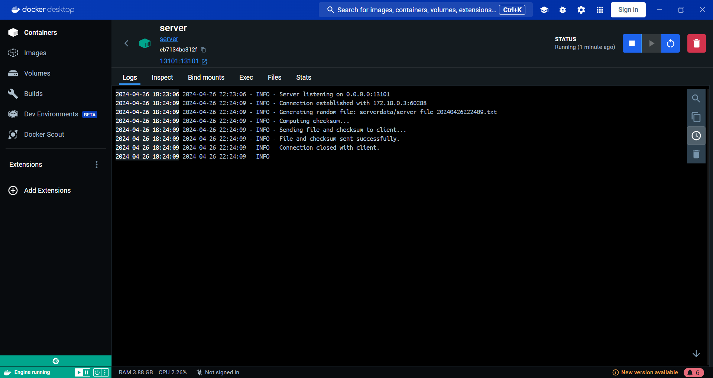

# **Screenshots:**

## Prerequistes:
### Creating Server Volume

### Creating Client Volume

### 1. Running on local machine:

### 2. Running on local machine by passing port and host as command line argument:

### 3. Buidling Server Image:

### 4. Buidling Client Image:

### 5. Docker Desktop Images Dashboard:

### 6. Server Container Logs:

### 7. Client Container Logs:

### 8. Server Volume Logs:

### 9. Client Volume Logs:

### 10. Checking if both the containers are runnig on same network using inspect command:

### 11. Docker Compose Build:

### 12. Docker Desktop Container Dashboard:

### 13. Client Container Logs:

### 14. Server Container Logs:

### 15. Client Volume Logs:

### 16. Server Volume Logs:
